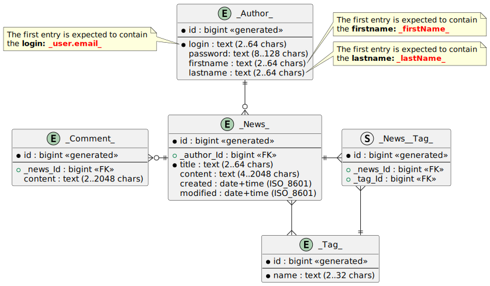

#  Task320. Storage layer (JPA)

### Given: 
- The system under development handles entities **{{Author}}**, **{{News}}**, **{{Tag}}**, and **{{Comment}}**, which are logically related by 
  - one-to-many (**{{Author}}** and **{{News}}**, **{{News}}** and **{{Comment}}**) 
  - many-to-many (**{{News}}**, **{{Tag}}**). 
- It is necessary to implement the storage of entities in a relational database **Postgres**, taking into account the future of the application.
 
### Task

The basis for the task is the following application diagram

**Attention, the table prefix is not specified, but it must be in the solution**

- Data model:
  - Uses entities from previous work as shown in the diagram 
    - **{{Author}}**
    - **{{News}}**
    - **{{Tag}}**
    - **{{Comment}}**
    - You can use a common abstraction for entities if necessary
- Storage layer:
  - Write a database initialization script, we recommend using **liquibase** in XML format
  - Verify the creation of tables **tbl_{{author}}**, **tbl_{{news}}**, **tbl_{{tag}}**, and **tbl_{{comment}}**.
  - Improve the generalized interface for storing and retrieving entity data for CRUD operations:
      - Search and selection operations must support pagination, filtering, and sorting
  - Test the designed experience for the **{Author}}**, **{{News}}**, **{{Tag}}**, and **{{Comment}}** entities.

### Technical requirements

- **IMPORTANT!** Use the **/api/v1.0/** prefix for REST controllers and their methods,
  - **IMPORTANT!** Use the address and port of **localhost:24110** for the application itself.
  - IMPORTANT: Use the following information when connecting to Postgresql
    - Driver prefix **jdbc:postgresql:**
    - Database address **localhost**
    - Database port **5432**
    - user **postgres**
    - password **postgres**
    - Diagram **distcomp**
  - **IMPORTANT** Use the required prefix **tbl_** for tables in the database

### Recommendations

#### Possible solutions

- As a programming language for the backend, it is best to use the Java language with its ecosystem (Maven, Spring, Mapstruct, etc.)
- Use the Spring Boot starter: `org.springframework.boot:spring-boot-starter-data-jpa` to implement the [JPA] functions - this is the easiest way to solve it.
- In agreement with the course leader/mentor/trainer/lecturer/teacher, other programming languages can be used (not recommended).

#### Pending operations

Cm. previous 310 REST task

#### Validation

All input parameters (queries) must be validated directly in the business logic code using a special check or the functions of the framework used.
>Note. To support your custom annotations and perform validation outside the code of the business logic, you can use specialized solutions,
>For example: [Aspects](https://docs.spring.io/spring-framework/docs/current/reference/html/core.html#aop).

#### Testing

- [x] Add Unit tests for the new functionality (**TestContainers** recommended)
- [x] Augment the controller layer with YOUR JUnit tests, using, for example: [RestAssured Framework](https://semaphoreci.com/community/tutorials/testing-rest-endpoints-using-rest-assured).
- [x] Test the REST controllers on **{Author}}**, **{{News}}**, **{{Tag}}**, and **{{Comment}}**.
- REST controllers must support [CRUD](https://en.wikipedia.org/wiki/Create,_read,_update_and_delete) operations for the above-mentioned objects, i.e. they must implement the following functionality:
  - [x] Support for searching **{{Author}}**, **{{News}}**, **{{Tag}}**, and **{{Comment}}** by the **{{id}}** key field.
  - [x] Support for creating **{Author}}**, **{News}}**, **{{Tag}}**, and **{{Comment}}** entities.
  - [x] Support for modifying **{{Author}}**, **{{News}}**, **{{Tag}}**, and **{{Comment}}**.
  - [x] Support for deleting **{{Author}}**, **{{News}}**, **{{Tag}}**, and **{{Comment}}** by the **{{id}}** key field.

#### Mandatory requirements:

1. The code must be clean and must not contain any constructs intended exclusively for developers.
2. The app should be designed and written with OOP, SOLID, and REST design best practices in mind.
3. A clear multi-level structure should be used, defining the responsibilities of each application layer.
4. All business logic should be written in services: mapping `model` to `dto` and vice versa, validation, etc.
5. The web module must receive and return dto objects.
6. Controller methods that return a dto collection will need to support pagination and sorting in future versions.
7. Controllers and their methods must support version control.
8. Convenient error handling should be implemented: all errors should be meaningful and understandable. 
9. Errors must contain `errorMessage` and `errorCode`, where `errorCode` is your five-digit code, in which the first three digits of the code match the response code in the HTTP header and the remaining two have arbitrary values, but are logically related to errorMessage.
10. The app must be tested and pass all test suites.

#### Application recommendations:

1. JDK 21 is the expected runtime.
2. Maven. So far, the architecture is arbitrary, but in the end we will get a multi-module project based on Spring Boot.
3. Programming language: Java
