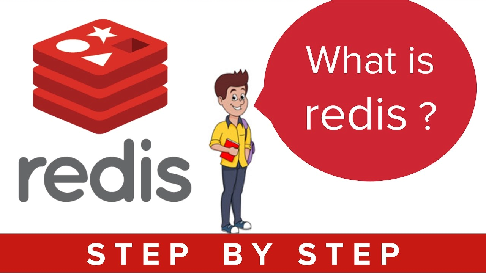
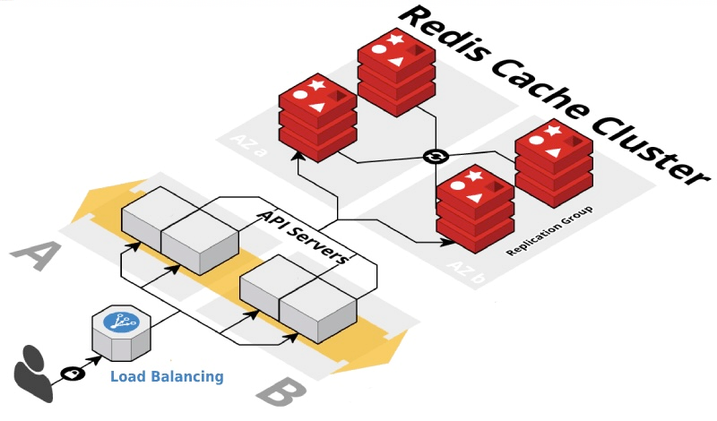

## Что такое Redis?

Этот файл README представляет собой просто быстрый _quick start_ документ. Более подробную документацию можно найти по адресу [redis.io](https://redis.io/).

Redis часто называют сервером _data structures_. Это означает, что Redis предоставляет доступ к изменяемым структурам данных с помощью набора команд, которые отправляются по модели _server-client_ с сокетами TCP и простым протоколом. Таким образом, разные процессы могут запрашивать и изменять одни и те же структуры данных общим способом.



Структуры данных, реализованные в Redis, имеют несколько специальных свойств:

- Redis хранит их на диске, даже если они всегда обслуживаются и изменяются в памяти сервера. Это означает, что Redis быстрый, но при этом энергонезависимый.
- Реализация структур данных делает упор на эффективность памяти, поэтому структуры данных внутри Redis, скорее всего, будут использовать меньше памяти по сравнению с той же структурой данных, смоделированной с помощью языка программирования высокого уровня.
- Redis предлагает ряд функций, которые естественно найти в базе данных, такие как репликация, настраиваемые уровни устойчивости, кластеризация и высокий уровень доступности.

Другой хороший пример — думать о Redis как о более сложной версии memcached, где операции — это не только SET и GET, но и операции, работающие со сложными типами данных, такими как списки, наборы, упорядоченные структуры данных и так далее.

Если вы хотите узнать больше, вот список выбранных отправных точек:

- Введение в типы данных Redis. https://redis.io/topics/data-types-intro
- Попробуйте Redis прямо в браузере. https://try.redis.io
- Полный список команд Redis. https://redis.io/commands
- В официальной документации Redis есть еще много интересного. https://redis.io/documentation

## Сборка Redis

Redis может быть скомпилирован и использован на Linux, OSX, OpenBSD, NetBSD, FreeBSD. Мы поддерживаем архитектуры с прямым порядком байтов и прямым порядком байтов, а также 32-разрядные и 64-разрядные системы.



Он может компилироваться на производных от Solaris системах (например, SmartOS), но наша поддержка этой платформы _best effort_ и не гарантируется, что Redis будет работать так же хорошо, как в Linux, OSX и *BSD.

Это так просто, как:

```go
% make
```

Для сборки с поддержкой TLS вам понадобятся библиотеки разработки OpenSSL (например, libssl-dev в Debian/Ubuntu) и выполните:

```shell
% make BUILD_TLS=yes
```

Для сборки с поддержкой systemd вам понадобятся библиотеки разработки systemd (такие как libsystemd-dev в Debian/Ubuntu или systemd-devel в CentOS) и выполните:

```shell
% make USE_SYSTEMD=yes
```

Чтобы добавить суффикс к именам программ Redis, используйте:

```go
% make PROG_SUFFIX="-alt"
```

Вы можете собрать 32-битный двоичный файл Redis с помощью:

```go
% make 32bit
```

После сборки Redis рекомендуется протестировать его с помощью:

```shell
% make test
```

Если TLS собран, запуск тестов с включенным TLS (вам потребуется установить 'tcl-tls'):

```shell
% ./utils/gen-test-certs.sh
% ./runtest --tls
```

## Исправление проблем сборки с зависимостями или кэшированными параметрами сборки

У Redis есть некоторые зависимости, которые включены в каталог 'deps'. 'make' не перестраивает зависимости автоматически, даже если что-то в исходном коде зависимостей меняется.


Когда вы обновляете исходный код с помощью git pull или когда код внутри дерева зависимостей изменяется каким-либо другим образом, обязательно используйте следующую команду, чтобы действительно очистить все и пересобрать с нуля:

```go
% make distclean
```

Это очистит: jemalloc, lua, hiredis, linenoise и другие зависимости.

Кроме того, если вы принудительно используете определенные параметры сборки, такие как 32-битная цель, отсутствие оптимизаций компилятора C (для целей отладки) и другие подобные варианты времени сборки, эти параметры кэшируются на неопределенный срок до тех пор, пока вы не выполните команду 'make distclean'.

## Исправление проблем при сборке 32-битных двоичных файлов

Если после сборки Redis с 32-битной целью вам нужно пересобрать его с 64-битной целью, или наоборот, вам нужно выполнить 'make distclean' в корневом каталоге дистрибутива Redis.

В случае ошибок сборки при попытке собрать 32-битный двоичный файл Redis, попробуйте выполнить следующие действия:

- Установите пакет libc6-dev-i386 (also try g++-multilib).
- Попробуйте использовать следующую командную строку вместо `make 32bit`: `make CFLAGS="-m32 -march=native" LDFLAGS="-m32"`

## Распределитель

Выбор нестандартного распределителя памяти при сборке Redis осуществляется путем установки переменной окружения 'MALLOC'. Redis компилируется и компонуется с libc malloc по умолчанию, за исключением jemalloc, используемого по умолчанию в системах Linux. Этот вариант по умолчанию был выбран потому, что jemalloc оказался менее уязвимым для фрагментации, чем libc malloc.

Чтобы принудительно скомпилировать в libc malloc, используйте:

```go
% make MALLOC=libc
```

Чтобы скомпилировать с jemalloc на системах Mac OS X, используйте:

```go
% make MALLOC=jemalloc
```

## Монотонные часы

По умолчанию Redis будет строить с использованием функции POSIX clock_gettime в качестве источника монотонных часов. В большинстве современных систем для повышения производительности можно использовать внутреннюю тактовую частоту процессора. С предостережениями можно ознакомиться здесь: http://oliveryang.net/2015/09/pitfalls-of-TSC-usage/

Для сборки с поддержкой внутренней частоты инструкций процессора используйте:

```go
% make CFLAGS="-DUSE_PROCESSOR_CLOCK"
```

## Подробная сборка

По умолчанию Redis будет выполнять сборку с удобным для пользователя цветным выводом. Если вы хотите получить более подробный вывод, используйте следующее:

```go
% make V=1
```

## Запуск Redis

Чтобы запустить Redis с конфигурацией по умолчанию, просто введите:

```shell
% cd src
% ./redis-server
```

Если вы хотите предоставить свой файл redis.conf, вам необходимо запустить его, используя дополнительный параметр (путь к файлу конфигурации):

```shell
% cd src
% ./redis-server /path/to/redis.conf
```

Конфигурацию Redis можно изменить, передав параметры непосредственно в виде опций с помощью командной строки. Примеры:

```shell
% ./redis-server --port 9999 --replicaof 127.0.0.1 6379
% ./redis-server /etc/redis/6379.conf --loglevel debug
```

Все опции в redis.conf также поддерживаются как опции с использованием командной строки, с точно таким же именем.

## Запуск Redis с TLS:

Обратитесь к файлу [TLS.md](http://localhost:24100/TLS.md) для получения дополнительной информации о том, как использовать Redis с TLS.

## Игра с Redis

Вы можете использовать redis-cli для игры с Redis. Запустите экземпляр redis-server, затем в другом терминале попробуйте следующее:

```shell
% cd src
% ./redis-cli
redis> ping
PONG
redis> set foo bar
OK
redis> get foo
"bar"
redis> incr mycounter
(integer) 1
redis> incr mycounter
(integer) 2
redis>
```

Список всех доступных команд вы можете найти на странице https://redis.io/commands.

## Установка Redis

Для того, чтобы установить двоичные файлы Redis в /usr/local/bin, просто используйте:

```go
% make install
```

Вы можете использовать `make PREFIX=/some/other/directory install`, если хотите использовать другое место назначения.

`make install` просто установит двоичные файлы в вашу систему, но не настроит скрипты инициализации и конфигурационные файлы в нужном месте. Это не требуется, если вы просто хотите немного поиграть с Redis, но если вы устанавливаете его правильным образом для производственной системы, у нас есть скрипт, который делает это для систем Ubuntu и Debian:

```shell
% cd utils
% ./install_server.sh
```

_Заметка_: `install_server.sh` не будет работать на Mac OSX; он собран только для Linux.

Скрипт задаст вам несколько вопросов и настроит все необходимое для правильной работы Redis в качестве фонового демона, который будет запускаться снова при перезагрузке системы.

Вы сможете останавливать и запускать Redis с помощью скрипта с именем `/etc/init.d/redis_<portnumber>`, например `/etc/init.d/redis_6379`.

## Вклад в код

Внося свой вклад в проект Redis в любой форме, включая отправку запроса на вытягивание через GitHub, фрагмента кода или патча по частной электронной почте или в открытых дискуссионных группах, вы соглашаетесь выпустить свой код в соответствии с условиями [Лицензионного соглашения Redis Software Grant and Contributor License Agreement](https://github.com/redis/redis/blob/unstable/CONTRIBUTING.md). Программное обеспечение Redis содержит вклады в оригинальный основной проект Redis, которые принадлежат их участникам и лицензируются под лицензией 3BSD. Любая копия этой лицензии в этом репозитории применяется только к этим вкладам. Redis выпускает все версии проекта Redis начиная с 7.4.x и далее под двойной лицензией RSALv2/SSPL, как описано в файле [LICENSE.txt](https://github.com/redis/redis/blob/unstable/LICENSE.txt), включенном в исходный дистрибутив Redis.

Пожалуйста, обратитесь к файлу [CONTRIBUTING.md](https://github.com/redis/redis/blob/unstable/CONTRIBUTING.md) в этом исходном дистрибутиве для получения дополнительной информации. Сведения об ошибках и уязвимостях безопасности см. в разделе [SECURITY.md](https://github.com/redis/redis/blob/unstable/SECURITY.md).

## Товарные знаки Redis

Целью товарного знака является идентификация товаров и услуг человека или компании, не вызывая путаницы. В качестве зарегистрированного владельца своего наименования и логотипа Redis допускает определенные виды ограниченного использования своих товарных знаков, но у нее есть требования, которые необходимо соблюдать, как описано в Руководстве по товарным знакам, доступном по адресу: https://redis.com/legal/trademark-guidelines/.

# Внутреннее устройство Redis

Если вы читаете этот README, вы, скорее всего, находитесь перед страницей на Github или вы только что распаковали дистрибутив Redis tar ball. В обоих случаях вы в основном находитесь в одном шаге от исходного кода, поэтому здесь мы объясняем схему исходного кода Redis, что находится в каждом файле в качестве общей идеи, наиболее важные функции и структуры внутри сервера Redis и так далее. Мы ведем обсуждение на высоком уровне, не углубляясь в детали, так как в противном случае этот документ был бы огромным, и наша кодовая база постоянно меняется, но общая идея должна быть хорошей отправной точкой для понимания большего. Более того, большая часть кода сильно комментирована и проста для понимания.

Есть также много других файлов, которые здесь не описаны, но охватывать все бесполезно. Мы просто хотим помочь вам с первыми шагами. В конце концов вы найдете свой путь в кодовой базе Redis :-)

Наслаждаться!
